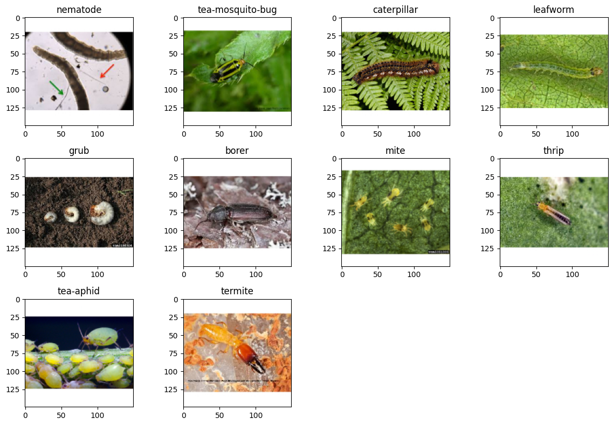
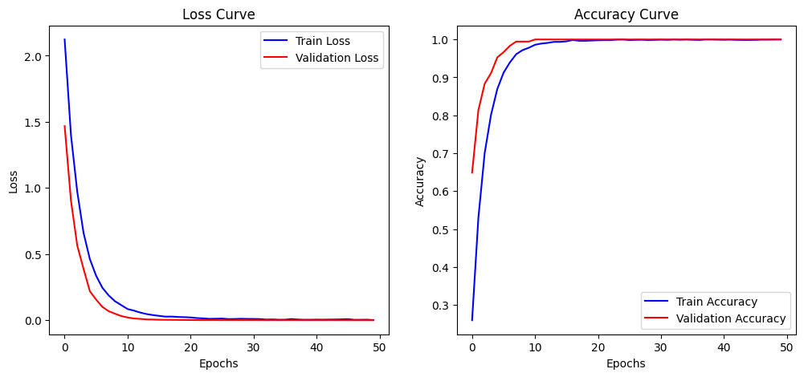
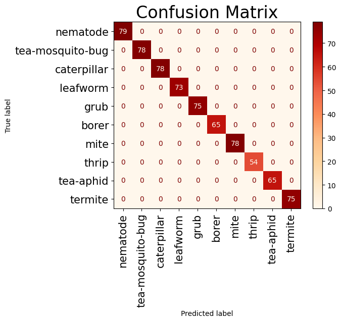
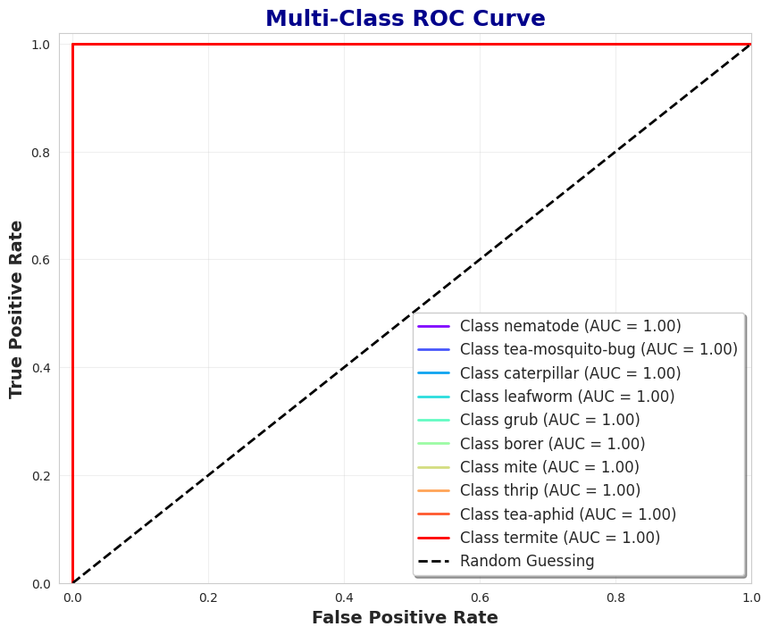
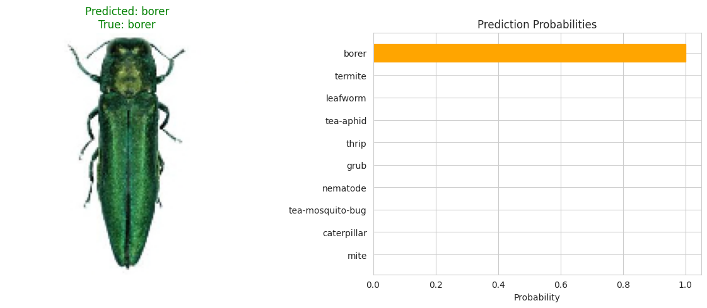
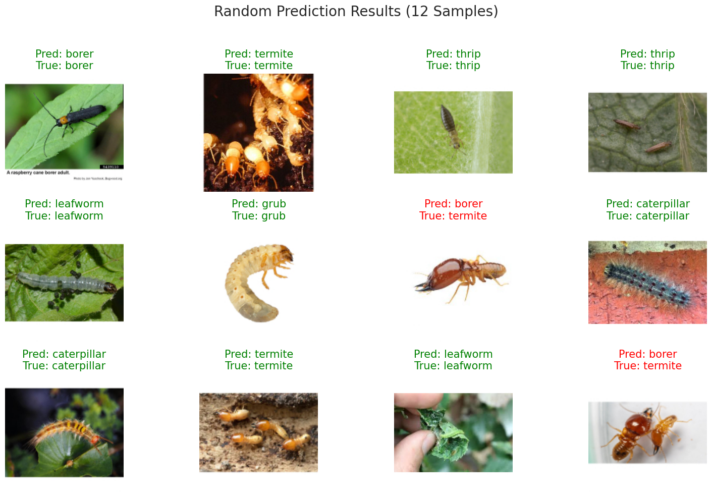
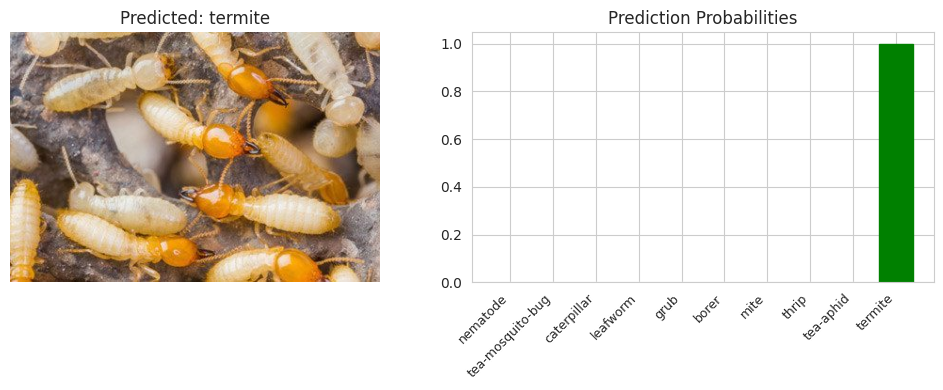

# 🐛 Tea Leaves Pest Classifier | Transfer Learning

This project is a custom-trained image classification model designed to detect and classify 10 types of insect pests commonly found on tea leaves. The entire pipeline—from dataset creation to prediction—is built and documented by **Birendra**, a Computer Science student exploring practical applications of deep learning in agriculture.

<div align="center">
  
</div>


## 🔍 Project Highlights

- ✅ **Custom Image Dataset** (manually created, cleaned, and structured)
- 📊 **10-Class Insect Pest Detection** (tea pest species)
- 🔁 **Transfer Learning** with pretrained **VGG-16**
- 🌐 **Online Image Prediction** via URL support
- 📈 **Performance Metrics** (confusion matrix, accuracy, AUC, classification report)
- 🧪 **Test on Custom Split** with non-augmented test images


## 🗃️ Dataset Details

All images are resized to **150×150 pixels** and organized into separate `train/` and `test/` folders.

```
pest/
├── train/
│   ├── borer/               # 60 images × 5 copies = 300
│   ├── caterpillar/
│   ├── ...
├── test/
│   ├── borer/               # 60 original images
│   ├── caterpillar/
│   ├── ...

````

## 🐞 Classes

| No. | Class Name       | Directory Name     |
| --- | ---------------- | ------------------ |
| 1   | Borer            | `borer`            |
| 2   | Caterpillar      | `caterpillar`      |
| 3   | Grub             | `grub`             |
| 4   | Leafworm         | `leafworm`         |
| 5   | Mite             | `mite`             |
| 6   | Nematode         | `nematode`         |
| 7   | Tea Aphid        | `tea-aphid`        |
| 8   | Tea Mosquito Bug | `tea-mosquito-bug` |
| 9   | Termite          | `termite`          |
| 10  | Thrip            | `thrip`            |

## 🧠 Model Summary

| Component         | Details                           |
| ----------------- | --------------------------------- |
| Base Model        | VGG-16 (pretrained on ImageNet)   |
| Input Shape       | 150×150×3                         |
| Head Architecture | Flatten → Dense → Dropout → Dense |
| Optimizer         | Adam (`lr=1e-4`)                  |
| Loss              | Categorical Crossentropy          |
| Output            | 10 Softmax units (multi-class)    |
| Metrics Tracked   | Accuracy, AUC                     |

## 🏋️ Training Metrics Visualization

<div align="center">
  
</div>

* Tracks **accuracy** and **AUC** per epoch
* Shows convergence trend and training stability

## 📊 Confusion Matrix

<div align="center">
  
</div>

* Clear breakdown of model predictions
* Helps identify class-level confusion or imbalance

## 📋 Classification Report

```
Classification Report:
                   precision    recall  f1-score   support

        nematode       1.00      1.00      1.00        79
tea-mosquito-bug       1.00      1.00      1.00        78
     caterpillar       1.00      1.00      1.00        78
        leafworm       1.00      1.00      1.00        73
            grub       1.00      1.00      1.00        75
           borer       1.00      1.00      1.00        65
            mite       1.00      1.00      1.00        78
           thrip       1.00      1.00      1.00        54
       tea-aphid       1.00      1.00      1.00        65
         termite       1.00      1.00      1.00        75

        accuracy                           1.00       720
       macro avg       1.00      1.00      1.00       720
    weighted avg       1.00      1.00      1.00       720
```

* Includes **precision**, **recall**, and **F1-score**
* Offers class-wise insights into performance

## 🎯 ROC Curve (One-vs-Rest)

<div align="center">
  
</div>

* Multi-class ROC curves (One-vs-Rest strategy)
* Evaluates discriminative power of each class boundary

## 🎲 Random Prediction `predict_random()`

This function selects a **random image** from the test set, makes a prediction, and visualizes the result with a **probability bar chart**.

```python
predict_random()
```

* Displays: predicted class, confidence scores, image preview

### 📸 Output Preview


## 📂 Predict from Test Directory `predict(...)`

You can directly predict any image from the dataset using a path:

```python
predict("/kaggle/input/tea-leaves-pest-dataset/TeaLeavesPest-Dataset/pest/test/grub/grub_07.jpg")
```

* Accepts any image path
* Outputs class prediction + confidence visualization

### 📸 Output Preview


## 🖼️ Visual Prediction Grid (12 Random Test Images)

This section demonstrates how the trained model performs on 12 randomly selected images from the **test** directory. Each image is shown alongside its **predicted** and **true** class. If the prediction is correct, the label is shown in **green**; otherwise, in **red**.

✅ **Correct Prediction**
❌ **Incorrect Prediction**

```python
# Automatically samples 12 test images and compares predictions
# Displays each image with predicted and true label

# (See full implementation inside the notebook)
```

### 📸 Output Preview

<p align="center">
  
</p>


## 🌐 Predict from Online Image

You can predict using **any internet image URL**:

```python
url = "https://www.holderspestsolutions.com/wp-content/uploads/2015/11/termites.jpg"
predict_from_url(url, model, class_names)
```

**Result**:

* Top prediction
* Full probability graph (bar chart)
* Image preview

### 📸 Output Preview



## 📚 How to Use

This repo is designed to be run **directly in Kaggle or Colab**.

### ▶️ Steps

1. Open `tea-leaves-pest-classifier-transfer-learning.ipynb` in [Kaggle](https://www.kaggle.com/) or [Google Colab](https://colab.research.google.com/).
2. Make sure the [Tea Leaves Pest - Dataset](https://www.kaggle.com/datasets/birendra41/tea-leaves-pest-dataset) dataset folder is available via Kaggle dataset or uploaded to Colab.
3. Run the notebook cells in order.
4. Optionally, use the final prediction cell to test any web image.


## 📜 License

This project is licensed under **Apache 2.0 License**.
You’re welcome to reuse the notebook, dataset, and model structure with credit.

## 🤝 Acknowledgments

* TensorFlow/Keras for VGG-16
* Matplotlib & scikit-learn for visualization
* PIL & Requests for web image processing

---

*Author: [Birendra Nath Nandi](https://www.linkedin.com/in/birendra-nath-nandi/)*  
*Date: July 2025*  
*License: Apache 2.0*